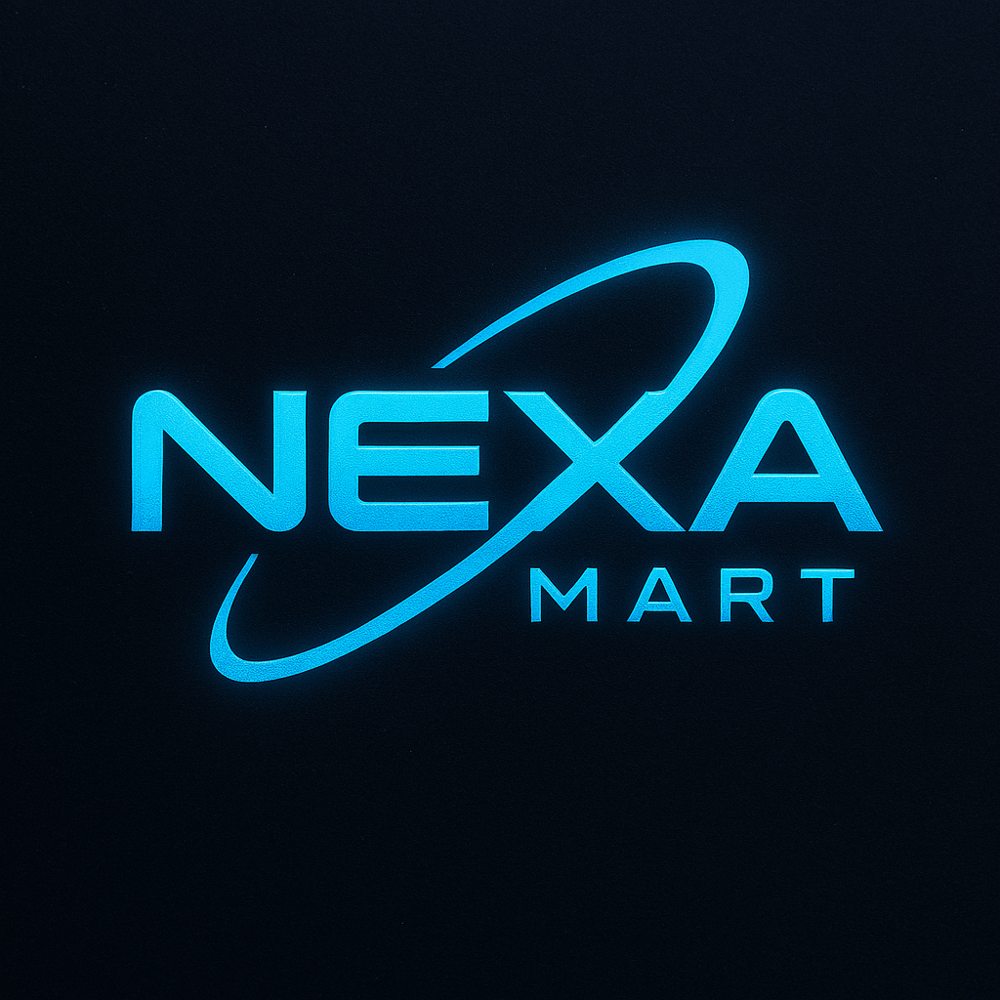
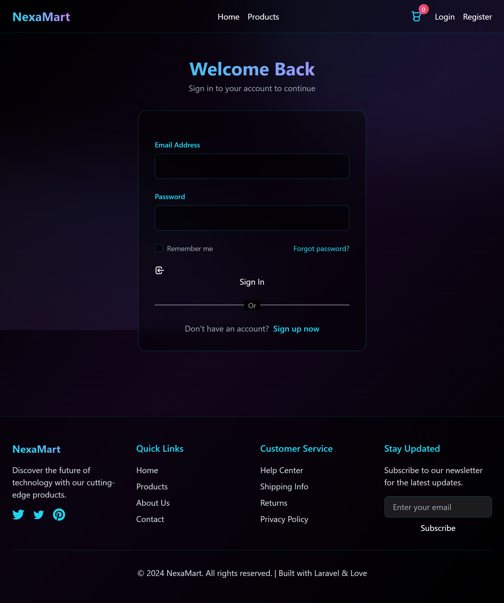
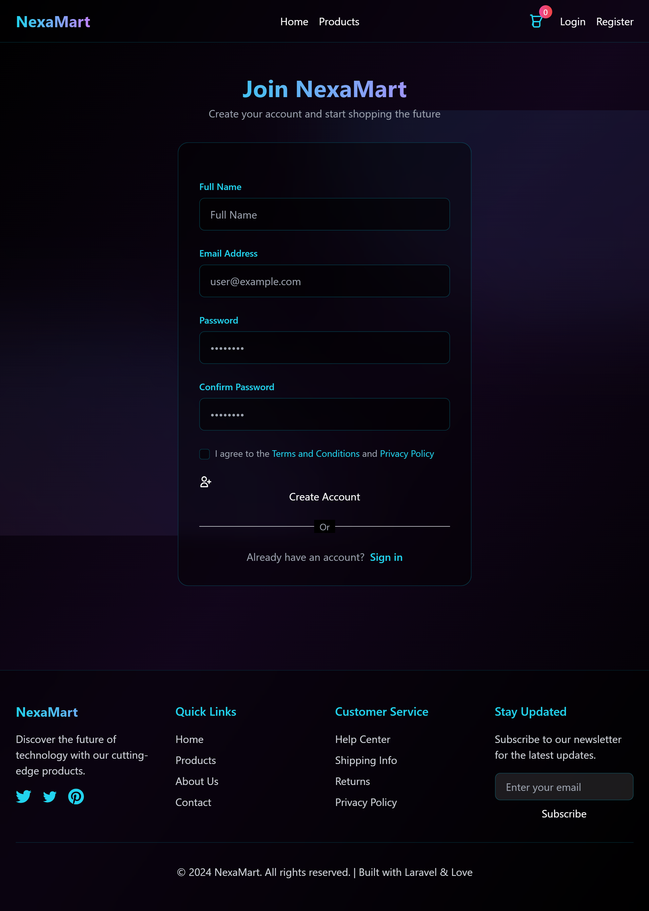
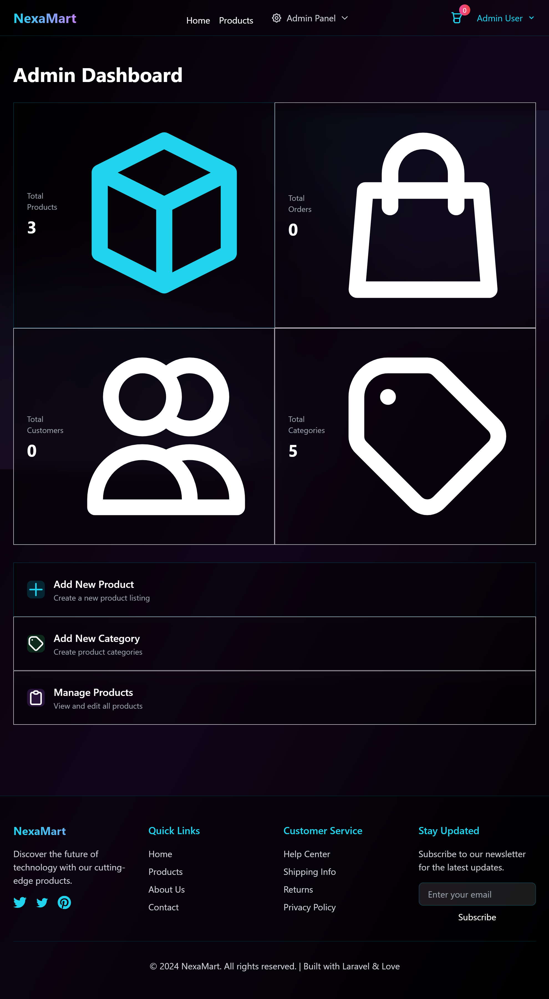

# ⚡ NexaMart - Futuristic E-commerce Platform  

 

> A cutting-edge **e-commerce platform** built with **Laravel 11**, featuring a **futuristic design with glassmorphism effects** and a complete shopping experience.  

[](https://laravel.com)  
[](https://www.php.net/)  
[](https://www.mysql.com/)  
[](https://tailwindcss.com/)  

---

## 📸 Screenshots

### 🏠 Home Page

*Futuristic homepage with glassmorphism design and featured products*

### 🛍️ Products Catalog

*Browse our extensive product catalog with advanced filtering*

### 🛒 Shopping Cart

*Seamless shopping cart experience with real-time updates*

### 👤 User Authentication
<div align="center">
  
  
</div>
<p align="center"><i>Secure authentication with modern UI</i></p>

### 👨‍💼 Admin Dashboard

*Comprehensive admin dashboard with store analytics and management tools*

---

## 📋 Table of Contents
- [Screenshots](#-screenshots)
- [About The Project](#-about-the-project)  
- [Features](#-features)  
- [Tech Stack](#-tech-stack)  
- [Project Structure](#-project-structure)  
- [Prerequisites](#-prerequisites)  
- [Installation](#-installation)  
- [Configuration](#-configuration)  
- [Usage](#-usage)  
- [Admin Panel](#-admin-panel)  
- [API Documentation](#-api-documentation)  
- [Database Schema](#-database-schema)  
- [Contributing](#-contributing)  
- [License](#-license)  

---

## 🚀 About The Project
NexaMart is a **modern e-commerce platform** that blends **next-gen design** with robust functionality. Built with **Laravel 11**, it provides a **dark, glassmorphism-inspired UI**, user-friendly shopping experience, and a powerful admin panel.

### Key Highlights
- 🎨 **Futuristic Design** – Dark theme + neon accents + glassmorphism  
- 🛒 **E-commerce Features** – Product catalog, cart, wishlist, checkout  
- 👤 **Role-based Access** – Separate interfaces for customers & admins  
- 📱 **Responsive** – Mobile-first design  
- 🔒 **Secure** – Laravel Breeze authentication & authorization  

---

## ✨ Features

### 🛍️ Customer Features
- **Authentication** (Register, Login, Profile management)  
- **Product Browsing**: search, filters, categories, image galleries  
- **Shopping Cart**: add/remove, update quantity, session persistence  
- **Wishlist**: save favorites  
- **Checkout**: streamlined order placement  
- **Order History**: track purchases  

### 👨‍💼 Admin Features
- Dashboard with store stats  
- Product management (CRUD, stock, pricing, discounts, multi-image)  
- Category management  
- Order management  
- User management  
- Low stock alerts  

### 🎨 Design Features
- Glassmorphism UI  
- Neon-accented dark theme  
- Smooth animations & reusable components  
- Fully responsive layout  

---

## 🛠️ Tech Stack

**Backend**  
- Laravel 11.x  
- PHP 8.2+  
- MySQL / PostgreSQL (Neon DB compatible)  
- Laravel Breeze (Auth)  

**Frontend**  
- TailwindCSS 3.x  
- Vanilla JS  
- Vite bundler  
- Heroicons  
- Orbitron font (Google Fonts)  

**Dev Tools**  
- Composer + NPM  
- Git  
- Laravel Artisan  

---

## 📁 Project Structure
```text
futuristic-product-showcase/
├── app/
│   ├── Http/Controllers/ (Admin, Auth, Cart, Product, Wishlist)
│   └── Models/ (User, Product, Category, Wishlist, Order)
├── database/ (migrations, seeders)
├── resources/views/ (layouts, admin, products, auth, cart, wishlist)
├── routes/web.php
├── public/
│   ├── images/
│   └── screenshots/
├── .env.example
├── composer.json
├── package.json
└── README.md


📋 Prerequisites

PHP >= 8.2


MySQL or PostgreSQL

Git

Required PHP Extensions: OpenSSL, PDO, Mbstring, Tokenizer, XML, Ctype, JSON, BCMath

🔧 Installation

# 1. Clone repository
git clone https://github.com/yourusername/futuristic-product-showcase.git
cd futuristic-product-showcase

# 2. Install dependencies
composer install
npm install

# 3. Create env file
cp .env.example .env

# 4. Generate key
php artisan key:generate

# 5. Configure DB in .env
DB_DATABASE=NexaMart
DB_USERNAME=root
DB_PASSWORD=

# 6. Run migrations + seed
php artisan migrate
php artisan db:seed --class=UserSeeder

# 7. Build frontend assets
npm run build

# 8. Start server
php artisan serve


 Visit http://localhost:8000

⚙️ Configuration

Important .env variables:

APP_NAME="NexaMart"
APP_ENV=local
APP_DEBUG=true
APP_URL=http://localhost:8000

DB_CONNECTION=mysql
DB_HOST=127.0.0.1
DB_PORT=3306
DB_DATABASE=NexaMart
DB_USERNAME=root
DB_PASSWORD=

Optional Mail Setup

MAIL_MAILER=smtp
MAIL_HOST=mailhog
MAIL_PORT=1025
MAIL_FROM_ADDRESS="hello@NexaMart.com"

📖 Usage
Default Accounts (Seeder)
Role	Email	Password
Admin	admin@NexaMart.com
	admin123
SuperAdmin	superadmin@NexaMart.com
	superadmin123
Customer	user@NexaMart.com
	user123
👨‍💼 Admin Panel

Access: /admin/dashboard (requires admin login)

Dashboard with statistics

Manage products & categories

Manage orders & customers

Low stock alerts

🗄️ Database Schema

users – role-based accounts

products – product catalog

categories – categories

orders & order_items – customer orders

wishlists – saved items

carts & cart_items – shopping carts


📝 License

This project is licensed under the MIT License.

👥 Authors

Your Name – GitHub Profile

🙏 Acknowledgments

Laravel

TailwindCSS

Heroicons

Orbitron Font

